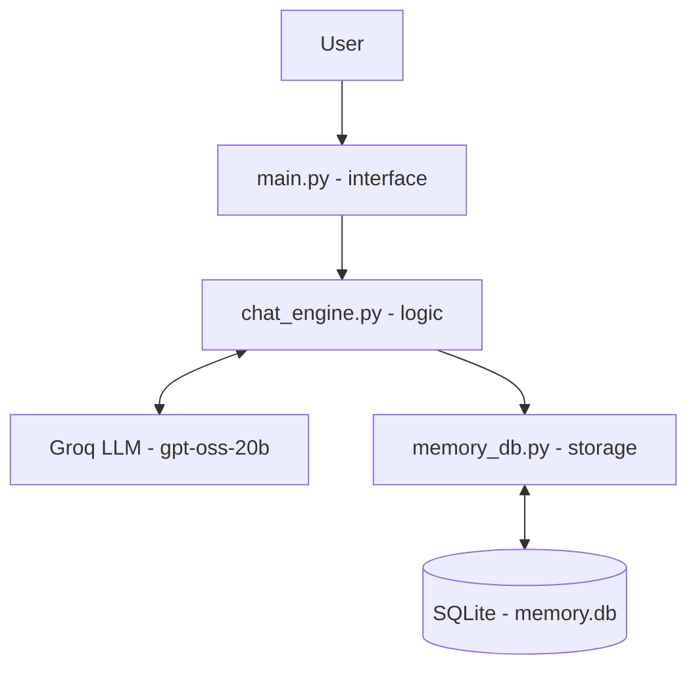

# AI Memory & Personalization Layer

A lightweight memory system that sits on top of an LLM and solves
a core problem with chatbots: **they forget everything between sessions.**

## Problem

Most LLM-based chatbots treat every conversation as if it's the first one.
Users have to repeat their context, preferences, skill level, and goals
every single time. This makes interactions feel disconnected and wastes
both the user's time and the system's tokens (since context has to be
re-explained instead of recalled).

## What this does

- Stores every conversation turn in a local database (SQLite for now).
- After every few turns, asks the LLM itself to extract durable facts
  about the user (preferences, goals, skill level, ongoing projects).
- Injects those facts into the system prompt of every future conversation
  — automatically, without the user repeating themselves.
- Over time, the assistant "knows" the user better instead of staying
  static from day one.

## Architecture

### System layers



### Message flow
```
User message
     │
     ▼
[ Save to messages table ]
     │
     ▼
[ Build system prompt from stored facts ]
     │
     ▼
[ Send to LLM with recent conversation history ]
     │
     ▼
[ Save assistant reply ]
     │
     ▼
[ Every N turns: extract new facts via LLM → store in facts table ]
```

## Tech Stack

- Python 3
- SQLite (local memory store — will move to PostgreSQL + pgvector
  for semantic retrieval in the next phase)
- Groq API (openai/gpt-oss-20b model)

## Setup

```bash
  pip install -r requirements.txt
  $env:GROQ_API_KEY="your-key-here"
  python main.py
```

## Status

🚧 **In Progress** — this is the foundational version (Phase 1 of a
30-day build). Current version proves the core memory loop works.

**Planned next:**
- Migrate to PostgreSQL + pgvector for semantic similarity search
  (so it retrieves *relevant* memories, not just recent ones)
- Goal-tracking layer (distinguish casual facts from active goals)
- Confidence scoring (reinforce facts that prove useful, decay ones
  that get corrected)
- Simple web UI (Streamlit) instead of CLI
- Deploy on Azure

## Why this matters

This addresses three real, common failure points in conversational AI:
1. **Missing the real need** — generic answers instead of personalized ones
2. **No long-term context** — forgetting past preferences and corrections
3. **Poor adaptation** — not adjusting depth/style to the actual user

## Author

Shubham Sharma